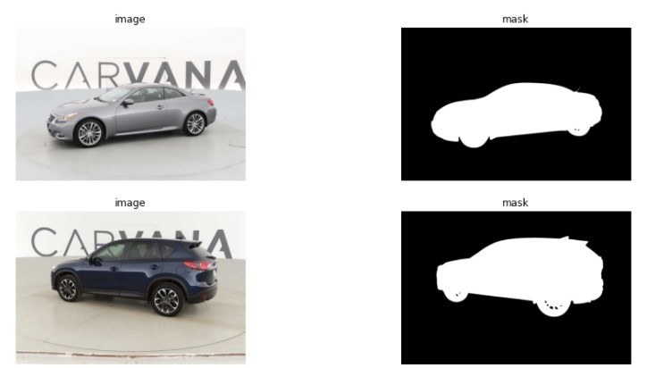
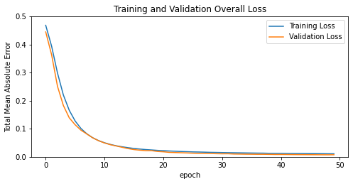
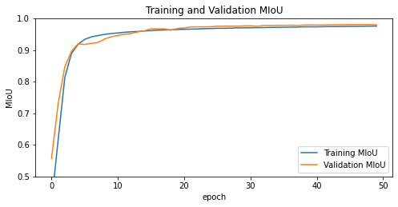
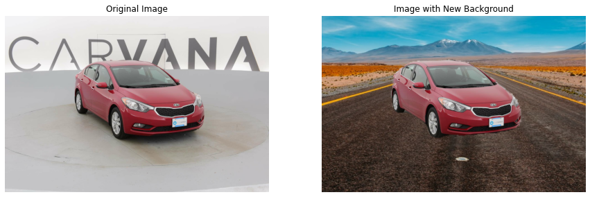
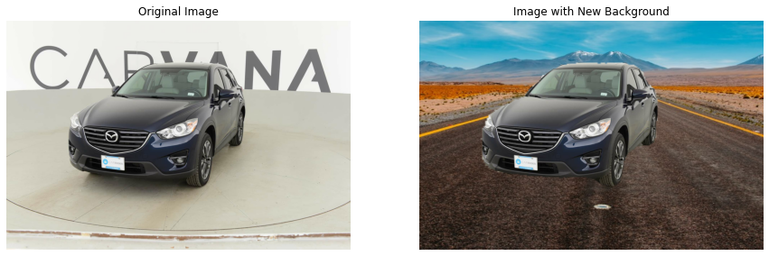
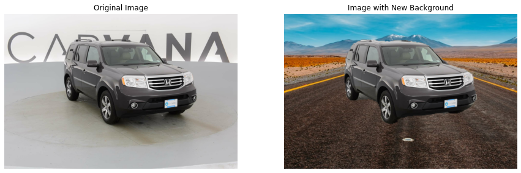

# Car Image Segmentation

## Why?
This is the experiment for segmenting car from the images in order to remove studio background. Experiments based on Deep learning Techniques to segment precise boundary of car.

## About Dataset
Carvana, a successful online used car startup, has seen opportunity to build long term trust with consumers and streamline the online buying process.

An interesting part of their innovation is a custom rotating photo studio that automatically captures and processes 16 standard images of each vehicle in their inventory. While Carvana takes high quality photos, bright reflections and cars with similar colors as the background cause automation errors, which requires a skilled photo editor to change.

This dataset contains a large number of car images (as .jpg files). Each car has exactly 16 images, each one taken at different angles. Each car has a unique id and images are named according to id_01.jpg, id_02.jpg ... id_16.jpg. In addition to the images.

For the training set, you are provided a .gif file that contains the manually cutout mask for each image.

### Examples

### Task
To develop an algorithm that automatically removes the photo studio background. This will allow Carvana to superimpose cars on a variety of backgrounds. You’ll be analyzing a dataset of photos, covering different vehicles with a wide variety of year, make, and model combinations.

## FrameWork

## Best Results
### Loss Curve

### Mean-Intersection-over-Union (MIoU) curve

### Sample Predictions with new background of input images

### Conclusion
Here, I got 98.09% Mean-Intersection-over-Union on validation set after 50 epochs. Still there is chance of increase in validation MeanIoU in further training.
